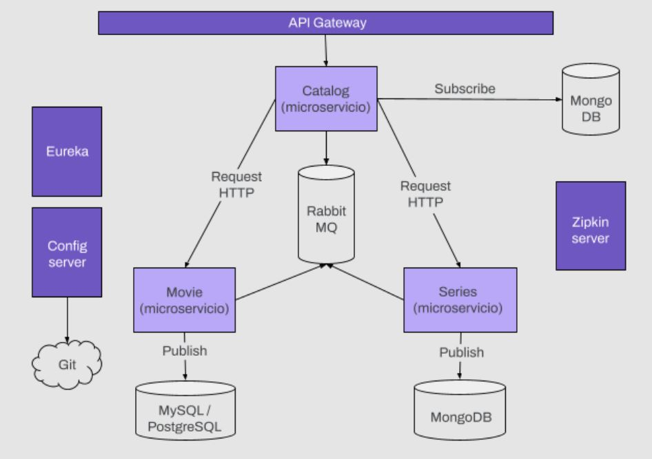
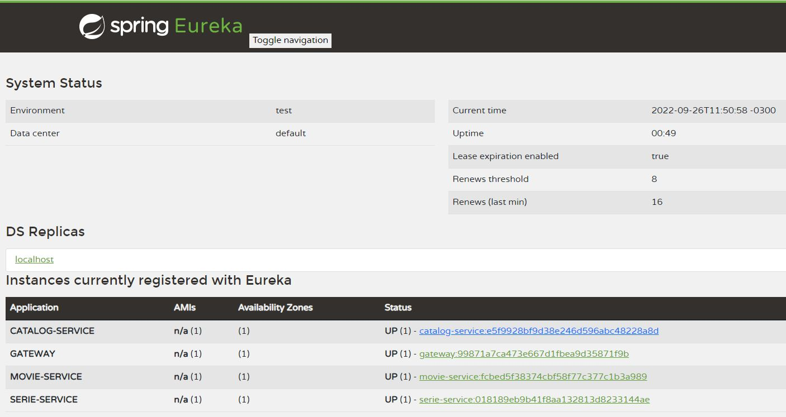
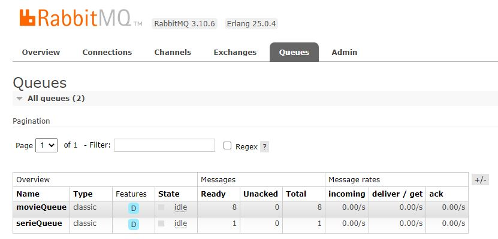
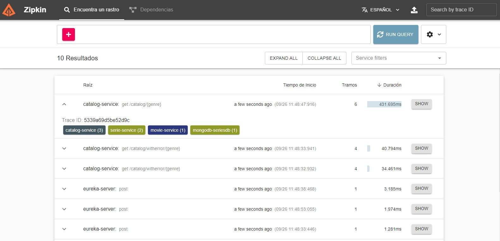
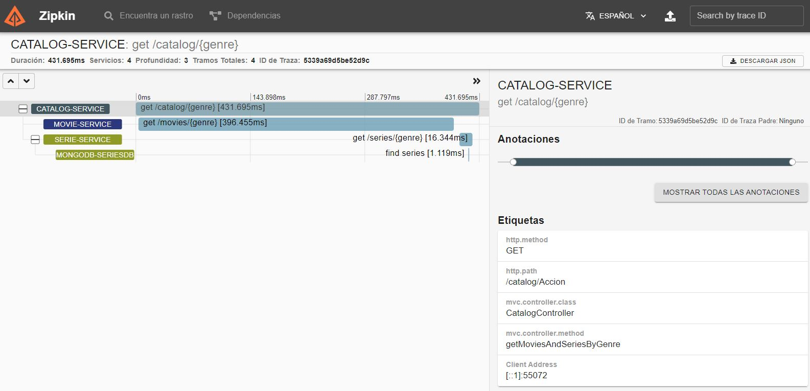

# Catalog-Project :clapper:
Backend application for movie and series queries using microservices architecture

This project was carried out for the Backend II subject of the Digital House Certified Tech Developer career. It consists of 
the development of a microservices architecture as seen below using Spring Cloud.

The Service Registry, Service Discovery, Central Configuration, Load Balancer, Edge Server, Distributed tracing and Circuit Breaker patterns are implemented in it. Besides, for communication between microservices Feign is used.

## Resources and technologies used
:cherry_blossom: Java

:cherry_blossom: Spring Boot

:cherry_blossom: Maven

:cherry_blossom: Hibernate 

:cherry_blossom: H2 Database

:cherry_blossom: MySQL

:cherry_blossom: MongoDB

:cherry_blossom: Spring Boot Actuator

:cherry_blossom: Spring Boot DevTools

:cherry_blossom: Lombok

:cherry_blossom: Spring Data JPA

:cherry_blossom: Spring Web

:cherry_blossom: Eureka Server and Eureka Discovery Client

:cherry_blossom: Config Server and Config Client

:cherry_blossom: Gateway

:cherry_blossom: Cloud LoadBalancer

:cherry_blossom: OpenFeign

:cherry_blossom: Spring Cloud Sleuth

:cherry_blossom: Zipkin

:cherry_blossom: RabbitMQ

:cherry_blossom: Resilience4J

:cherry_blossom: Postman to test API Endpoints

## Installation :octocat:
Clone the project from a terminal

`git clone https://github.com/danielabe/Catalog-Project.git`
## Open project :open_file_folder:
Open the project in an IDE
## Import modules
Add the following modules to the project structure: 
 
:cherry_blossom: catalog-service

:cherry_blossom: config-server

:cherry_blossom: eureka-server

:cherry_blossom: gateway

:cherry_blossom: movie-service

:cherry_blossom: serie-service

## MySQL Database:
Don't forget to update your password in movie-service.yml file in folder configs.

## Run :rocket:
Run the main classes in the following order: 
 
:cherry_blossom: run Zipkin server in a terminal

:cherry_blossom: config-server

:cherry_blossom: eureka-server

:cherry_blossom: catalog-service

:cherry_blossom: movie-service

:cherry_blossom: serie-service

:cherry_blossom: gateway

## Microservices registered in eureka server:

## Queues in RabbitMQ:

## Zipkin UI:

## Repository :octocat:
Link to the repository on GitHub:

https://github.com/danielabe/Movies-Project
